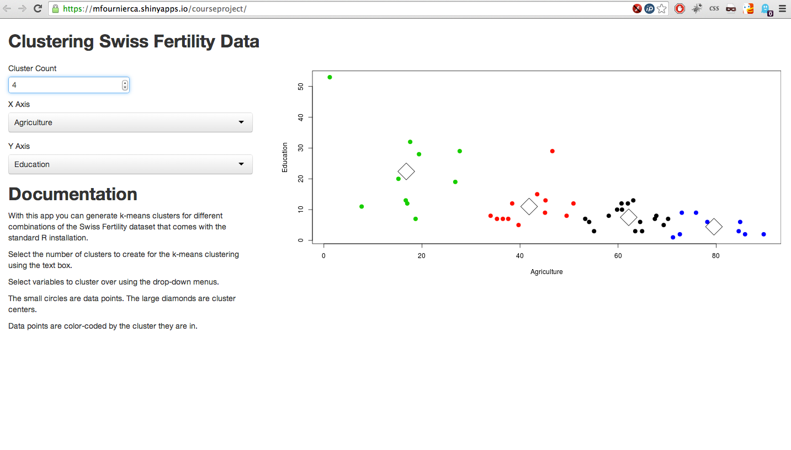

## Purpose

- Make it easy to observe clusters in a dataset
- Help students understand the basics of clustering
- Find important patterns in the data that could SAVE LIVES


---
## Screenshot



---
## How it Works

1. The server renders the page
2. The user selects the variables to cluster on and the number of clusters
3. These parameters are sent to the server, which calculates the clusters and returns a graph. 
4. The client displays the graph. 

---
## Demo

For example, the user selects:
- "Education" and "Agriculture" 
- 3 clusters 

The server then runs the code:

```{r fig.show='hide'}
selectedData <- swiss[, c("Education", "Agriculture")]
kclust <- kmeans(selectedData, 3)
plot(selectedData, col=kclust$cluster, pch=20, cex=2)
points(kclust$centers, pch=5, cex=4, lwd=1)
```


---
## Demo

The client displays the graph:

```{r echo=FALSE, fig.align='center', fig.height=7, fig.width = 10}
plot(selectedData, col=kclust$cluster, pch=20, cex=2)
points(kclust$centers, pch=5, cex=4, lwd=1)
```


--- 
## Invest

We are bringing the power of k-means clustering to the masses. It's obvious how this could change the world and save lives. 

This helps ordinary people with the sorts of data questions they face every day. 

Invest $10 million in this product. 

Not for me. For them. 

Thank you. 
